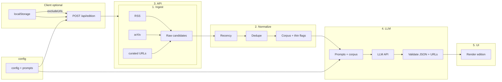

# System Design: Personal Daily AI Brief

**Companion to:** `requirements.md`  
**Scope:** MVP architecture (no database, no authentication, on-demand regeneration)  
**Last updated:** 2026-04-05

---

## 1. Recommended tech stack

| Layer | Choice | Rationale |
|-------|--------|-----------|
| **Language** | **TypeScript** | Shared types across ingestion, LLM I/O, and UI; catches schema mismatches when the model returns structured sections + URLs. |
| **Web framework** | **Next.js (App Router)** | UI + **server-only** routes; keeps **LLM and source API keys off the client** and avoids CORS when fetching RSS/HTML. |
| **UI** | **React** (via Next.js) | Sectioned layout, loading states, optional streaming. |
| **RSS / XML** | **`rss-parser`** (or equivalent) | Normalizes feeds to `title`, `link`, `pubDate`, `contentSnippet`. |
| **HTTP fetch** | **Native `fetch`** (Node 18+) | Retries/timeouts in a small wrapper. |
| **HTML → text (optional, later)** | **`@mozilla/readability`** + **`jsdom`** (or **cheerio**) | When feeds are summary-only and **ToS/robots** allow full-page fetch. |
| **LLM** | **Provider SDK** (OpenAI, Anthropic, etc.) or **OpenRouter** | **Structured outputs** / JSON schema for validation before render. |
| **Config** | **YAML or JSON** in `config/` | Feeds, recency windows, tiers — editable without rewiring core logic. |
| **Deployment (optional)** | **Node host** (Railway, Fly.io, VPS, Docker) or **Vercel** (with caveats) | Long “one click = full edition” jobs may hit **serverless timeouts** unless you stream, split work, or use a long-lived process (§6). |

**Why not a pure SPA (Vite + React only)?**  
Browser-side RSS/HTML hits **CORS**, exposes automation, and cannot hold **LLM keys**. A thin server (Next API routes, Express, FastAPI, or Streamlit) is required.

**Alternative:** **Python (FastAPI)** + **React (Vite)** — same **module boundaries** as §4; different runtime/packages.

---

## 2. Folder structure (full Next.js layout)

Reference layout under `cursor_ai-newsletter/` when you outgrow a single file:

```text
cursor_ai-newsletter/
├── requirements.md
├── system-design.md
├── package.json
├── tsconfig.json
├── next.config.js
├── .env.local                 # gitignored — LLM keys, optional tokens
├── config/
│   ├── sources.json           # feeds, tiers, curated URLs, recency overrides
│   └── voice.md               # optional long-form persona
├── prompts/
│   ├── system.md
│   ├── section-1-signals.md … section-5-thought.md
├── src/
│   ├── app/
│   │   ├── layout.tsx
│   │   ├── page.tsx
│   │   └── api/edition/route.ts    # POST → pipeline
│   ├── components/            # Newsletter, Section, progress, etc.
│   └── lib/
│       ├── types.ts
│       ├── config.ts
│       ├── ingest/            # rss, arxiv, curated, index
│       ├── normalize/         # recency, dedupe
│       ├── llm/               # client, schemas, compose-edition
│       └── pipeline/runEdition.ts
└── public/
```

**FR-12 (no DB):** e.g. `src/lib/client/recentUrls.ts` — **localStorage** key `brief_recent_urls_v1`, send `excludeUrls: string[]` with `POST /api/edition`.

---

## 3. Data flow (source → screen)

One **“Generate edition”** request:



**Steps:** (1) Browser calls API with optional `excludeUrls`. (2) **Ingest** → candidates with `url`, `title`, `publishedAt`, `tier`, text. (3) **Normalize** → `requirements.md` recency, client excludes, URL/title dedupe, `signalsThin` if needed. (4) **LLM** gets capped corpus + schema; citations should use **allowed URLs** from ingest. (5) **Validate** output; (6) return JSON (or stream); **React** renders linked sections.

---

## 4. Core modules

| Module | Role |
|--------|------|
| **Ingest** | Load config; fetch **RSS**, **arXiv**, optional **curated** pages. Output **`SourceCandidate[]`**. |
| **Normalize** | Recency, tier/keyword sort, dedupe, `excludeUrls`, **`Corpus`** + “signals thin” metadata. |
| **LLM compose** | Prompts + corpus → **structured output**; validate URLs; optional **repair** pass. Output **`Edition`**. |
| **Pipeline + API** | **`runEdition()`** on `POST /api/edition`: orchestrate, per-feed errors, **always five sections** with honest stubs if needed. |

**UI** stays thin: trigger, loading/errors, render **`Edition`**, localStorage exclusions.

---

## 5. External interfaces and APIs

| Interface | Use | Notes |
|-----------|-----|--------|
| **LLM provider API** | Summarize, consulting lens, five sections, **JSON + URLs** | **Server-side only**; one multi-section call vs several — trade cost, timeout, quality. |
| **RSS/Atom** | Tier 1–2 signals | Often partial content only. |
| **arXiv API** | Section 3 candidates | No key; polite **User-Agent**, rate limits. |
| **HTTP GET (curated)** | Snippets where RSS weak | **ToS**; prefer links + short excerpts. |
| **Reddit** (optional) | Tier 3 pulse | `.json`/RSS; limits/ToS. |
| **X API** (optional) | Tier 3 | Often **skipped** for MVP; manual links or compliant API only. |
| **LinkedIn** (optional) | Tier 3 | Usually **manual URLs** in config. |

**MVP:** no database API, no auth provider.

---

## 6. Risks and constraints

| Risk | Mitigation |
|------|------------|
| **Serverless timeouts** | Streaming; tight parallel ingest timeouts; long-lived Node; or split fetch vs compose. |
| **Hallucinated / broken links** | Prompt URL allowlist + post-parse validation + repair prompt. |
| **RSS only teasers** | Accept or add **Readability** where allowed. |
| **Paywalls** | Headline + link; manual curated URLs if you have access. |
| **Missing `pubDate`** | Fallback headers/meta; else **drop** for signal use. |
| **Rate limits / blocking** | In-request memory cache; backoff; polite **User-Agent**. |
| **ToS / legal** | Minimal excerpt storage; automate only allowed feeds/APIs. |
| **LLM cost** | Cap corpus; cheaper model for triage if you split steps. |
| **FR-12 without DB** | localStorage rolling list; new device = reset. |
| **Total failure** | Stub sections + retry, not a blank page. |

---

## 7. Implementation order (full product path)

1. **`Edition` schema** (Zod/TS) — five sections, required link fields.  
2. **Ingest + normalize** without LLM — log corpus until dates/dedupe look right.  
3. **LLM compose** — structured output + URL validation (and optional repair).  
4. **UI** — loading, Regenerate, **localStorage** `excludeUrls` last.

**Principles:** keys **server-side**, **structured** model output, **validate** links and recency against `requirements.md`.

---

## 8. MVP path: simpler stacks, essentials, and phasing

The §2 layout targets **growth**. For the **smallest readable newsletter** (five sections, links, on-demand regen, keys not in browser), use the following as a single plan.

### 8.1 Stack shortcuts (pick one)

| Option | Shape | Tradeoff |
|--------|--------|----------|
| **Streamlit / Gradio** | One–two Python files: fetch RSS (+ optional arXiv) → one prompt → LLM → `st.markdown` with links | Fastest UI; less custom polish. |
| **One server file + static HTML** | FastAPI or Express: `POST /generate` → JSON; vanilla JS or one Vite React page | Flat repo; no App Router ceremony. |
| **CLI → `out/edition.html`** | Script writes file; open in browser | No server until you want one; regen = re-run script. |

All three keep **LLM and fetching off the public client** (Streamlit runs server-side).

### 8.2 Non-negotiable for any MVP

- **Server-side** fetch + **LLM** (never ship API key to browser).  
- **Config list** of **5–10** working **RSS feeds** minimum.  
- **Parse** → unified `{ title, link, pubDate?, summary }`.  
- **Basic freshness** + **token cap** + **URL dedupe** within one run.  
- **One prompt** (or one `prompts.md`) — voice, consulting lens, five sections, **signal claims tied to corpus URLs** where required by PRD.  
- **One LLM response** shaping the full edition (**JSON** preferred).  
- **Browser-readable** output with real **`<a href>`** links.  
- **Regenerate** control + minimal **loading** feedback.

**Section 3 honesty:** With **RSS-only**, the lab section is only as strong as feeds; until **arXiv** (or a research blog RSS), accept a thinner lab or add one research feed early.

### 8.3 Strongly recommended (small effort)

- **Try/catch per feed** so one failure does not kill the run.  
- **Dedupe by URL** (FR-11-lite).

### 8.4 Defer until later

| Later add | Rationale |
|-----------|-----------|
| Full **§2** Next.js tree | When UI/routing/deploy patterns justify it. |
| **Per-section prompt files** | When tuning sections independently. |
| **Readability** / full HTML | When snippets too thin and ToS OK. |
| **arXiv module** | When Section 3 must be paper-grounded daily. |
| **Curated URL fetcher** | Paywalled / non-RSS sources. |
| **Strict Zod + URL allowlist** + **repair pass** | When link quality breaks trust. |
| **localStorage FR-12** | When same URLs repeat day to day. |
| **Token streaming UI** | UX polish. |
| **Tier 3 automation** (X, Reddit, LinkedIn APIs) | Friction; **manual config links** for MVP. |
| **Rich components** (`SourceLink`, fancy progress) | After pipeline stable. |
| **Standalone `voice.md`** | Optional; can live in one prompt file first. |

### 8.5 Minimal first-ship sequence

1. Config feeds → fetch/parse → merge → date filter + dedupe.  
2. Corpus text → **one LLM call** → edition JSON or Markdown.  
3. Render five sections with links.  
4. Add **arXiv** + stricter validation when sourcing needs hardening.

Then align with **§7** if you move to the full Next.js structure.

**Default recommendation:** **Streamlit + one LLM call + RSS-first corpus** for the first working edition; evolve to **Next.js** (or FastAPI + React) when you want sharper UX, streaming, or deployment habits.
